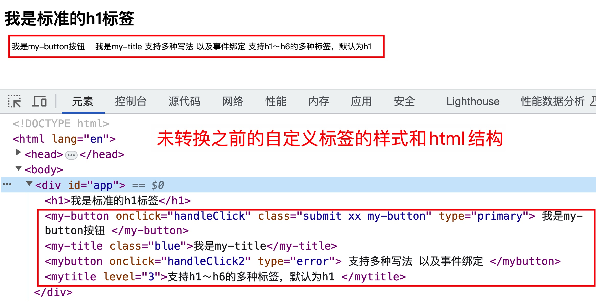
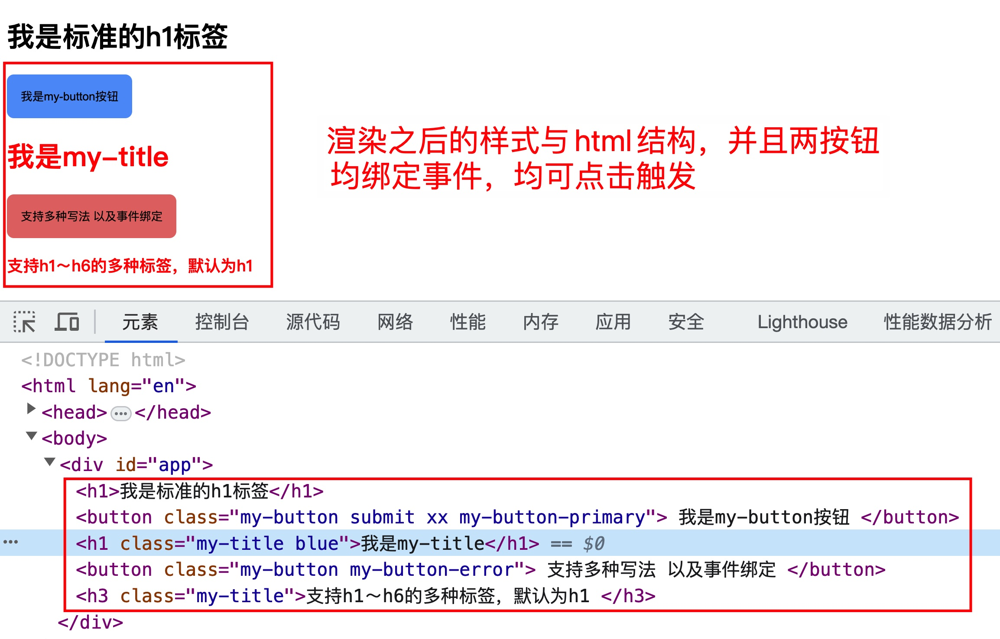

# 渲染自定义组件

## 需求描述

- 在`html`模版里直接编写**自定义、非`html`**的标签元素，并且支持多种写法。

  比如`<my-title></my-title>`、`<my-button></my-button>`或`<MyTitle></MyTitle>`、`<MyButton></MyButton>`

- 不影响正常的`html标签元素`的展示

- 能绑定事件，可以处理自定义标签特有的属性，并且支持在自定义标签上写`class`

  `<my-title level='1'></my-title>`中，`level`代表自定义元素的等级，比如默认为`h1`，根绝`level`的值自动生成`h1~h6`之间的标签元素

  `<my-button type='primary' onClick='handleClick'></my-button>`中，`type`指定按钮的状态类型，比如`primary`、`error`等，`onClick`代表给该自定义元素绑定的事件类型

## 准备工作

自定义标签`html`代码

```html
<div id="app">
  <h1>我是标准的h1标签</h1>
  <my-button onclick="handleClick" class="submit xx my-button" type="primary">
    我是my-button按钮
  </my-button>
  <my-title class="blue">我是my-title</my-title>
  <MyButton onclick="handleClick2" type="error">
    支持多种写法 以及事件绑定
  </MyButton>
  <MyTitle level="3">支持h1～h6的多种标签，默认为h1 </MyTitle>
</div>
```

## 效果展示

渲染自定义标签之前的页面样式和控制台的中`html`结构

### 渲染之前



### 渲染之后


